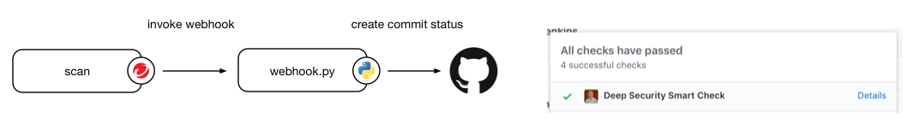

# webhook-set-github-status

[](https://opensource.org/licenses/Apache-2.0)

This module provides an example request handler that will process web hook events from
Deep Security Smart Check and write a commit status record in GitHub.

The image must have a label (by default, `vcs-ref`) that references the commit.
The repository name in GitHub must be the same as the repository name in the registry.



## Getting started

### Installing dependencies

You will need Python 3 and [pipenv](https://github.com/pypa/pipenv) to install the dependencies for this project.

```sh
$ pipenv install
Installing dependencies from Pipfile.lock (c53762)…
  🐍   ▉▉▉▉▉▉▉▉▉▉▉▉▉▉▉▉▉▉▉▉▉▉▉▉▉▉▉▉▉▉▉▉ 2/2 — 00:00:00
To activate this project's virtualenv, run the following:
 $ pipenv shell
```

### Create a GitHub API token

The web hook receiver needs a [GitHub API token](https://help.github.com/articles/creating-a-personal-access-token-for-the-command-line/) in order to create commit status records. The token must have the `repo:status` scope.

**The API token is like a password: make sure to store it securely!**

### Running the web hook receiver

Set [environment variables](#environment_variables) as needed for your environment and then run the script using `pipenv`.

```sh
$ export GITHUB_TOKEN=0000000000000000000000000000000000000000
$ export HMAC_SECRET="correct horse battery staple"
$ export URL_BASE="https://scanner.example.com/"
$ pipenv run ./webhook-set-github-status.py
serving on :8080
```

### Register the web hook receiver with Deep Security Smart Check

Replace `webhook.example.com` and `scanner.example.com` with the host names
of the web hook host and the Deep Security Smart Check host in this sample:

```sh
$ curl -H 'Content-Type: application/json' \
       -H 'Authorization: Bearer ...' \
       -d'{"name":"Set GitHub commit status",
           "hookUrl":"http://webhook.example.com:8080/",
           "secret":"correct horse battery staple",
           "events":["scan-completed"]}' \
       https://example.com/api/webhooks
```

_If your installation of Deep Security Smart Check does not have a trusted
certificate, you will need to include `--cacert FILE`, `--capath DIR`, or
`--insecure` in the `curl` command._

## Environment variables

| Name             | Sample value                               | Description                                                                                                                                                                                                     |
| ---------------- | ------------------------------------------ | --------------------------------------------------------------------------------------------------------------------------------------------------------------------------------------------------------------- |
| `GITHUB_URL`     | `https://github.example.com/api/v3/`       | The base URL for the GitHub API.<br>_Optional, defaults to `https://api.github.com/`._                                                                                                                          |
| `GITHUB_TOKEN`   | `0000000000000000000000000000000000000000` | A GitHub API token. This token must have the `repo:status` scope.<br>_Required_.                                                                                                                                |
| `HMAC_SECRET`    | `correct horse battery staple`             | A secret shared with the web hook in Deep Security Smart Check that can be used for authenticating requests.<br>_Optional, recommended_.                                                                        |
| `URL_BASE`       | `https://scanner.example.com/`             | The base URL for your Deep Security Smart Check installation. It will be used to convert the relative URL from the scan results into an absolute URL that will be attached to the commit status.<br>_Required_. |
| `LISTEN_ADDRESS` | `2001:0db8::1`                             | The address of the local interface to listen on.<br>_Optional, defaults to listening on all interfaces._                                                                                                        |
| `LISTEN_PORT`    | `8080`                                     | The port to listen on.<br>_Optional, defaults to `8080`._                                                                                                                                                       |
| `CONTEXT`        | `Deep Security Smart Check`                | The name of the status that will be shown in GitHub.<br>_Optional, defaults to `Deep Security Smart Check`._                                                                                                    |
| `COMMIT_LABEL`   | `vcs-ref`                                  | The name of the image label that references the commit in GitHub.<br>_Optional, defaults to `vcs-ref`._                                                                                                         |

## Customizing the policy

The default policy in this example is to create a status record with the status `failed` if the scan detects malware or unresolved vulnerabilities with a severity of `high` or greater.

You can customize the policy logic by modifying the `evaluate_findings` function.

## References

- [Dockerfile reference](https://docs.docker.com/engine/reference/builder/#label)
- [GitHub developer guide](https://developer.github.com/v3/repos/statuses)
- [Common image labels](https://github.com/projectatomic/ContainerApplicationGenericLabels)
